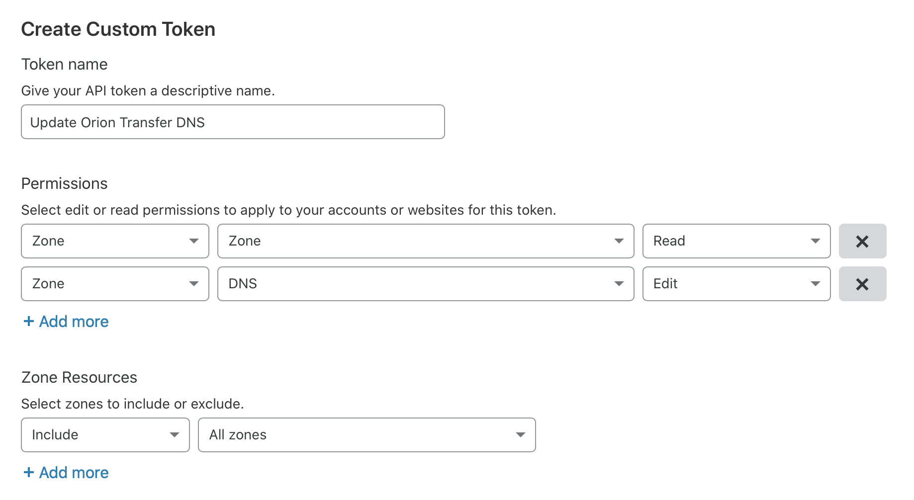
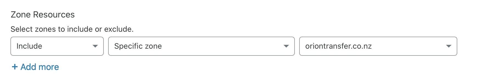

# Getting Started

This guide explains how to use `cloudflare-dns-update` to maintain an IPv4 and IPv6 dynamic DNS.

## Installation

Install the gem:

~~~ bash
$ gem install cloudflare-dns-update
~~~

## Usage

Run the included `cloudflare-dns-update` tool and you will be walked through the configuration process. You might want to specify a specific configuration file, using the `--configuration /path/to/configuration.yml` option.

<content:youtube id="lQK6bWuQllM" />

### Token Setup

You will need to create a Cloudflare token for authorization. Initially you need to create this token with full permissions to all zones within your account:

Once the configuration is set up, you can restrict the token to only the required zones:

### Daily updates using CRON

Simply set up configurations for each domain you wish to update, and add to `/etc/cron.daily/dyndns`, e.g.:

~~~ bash-script
#!/usr/bin/env sh

cloudflare-dns-update --configuration /srv/dyndns/example.A.yml
cloudflare-dns-update --configuration /srv/dyndns/example.AAAA.yml
~~~

Note that in case you want to update more than one domains in a zone with the same IP address, you can have multiple domains in a configuration file. Follow instructions of the configuration process. Just to note, each domain would be updated with the same content. Having both IPv4 and IPv6 records in the same configuration file is not possible nor recommended. Please create separate configuration files.

The configuration file would end up looking something like this:

~~~ yaml
---
:token: my_secret_token
:zone: example.com
:content_command: curl ipinfo.io/ip
~~~

### IPv6 Support

It is possible to update IPv6 when you have a dynamically allocated prefix. To get your current IPv6 address, the following command can be used:

~~~ bash-script
/sbin/ip -6 addr | awk -F '[ \t]+|/' '$3 == "::1"{next;} $3~/^fe80::/{next;} /inet6/{print $3}' | head -1
~~~
